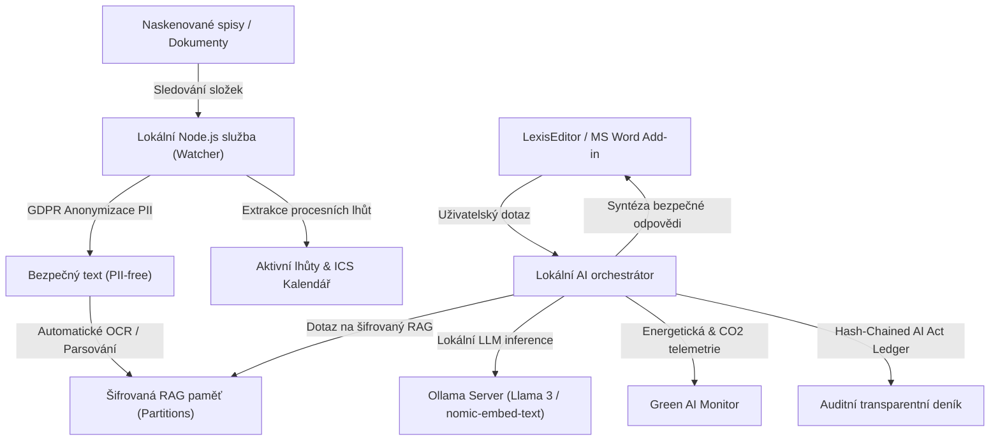
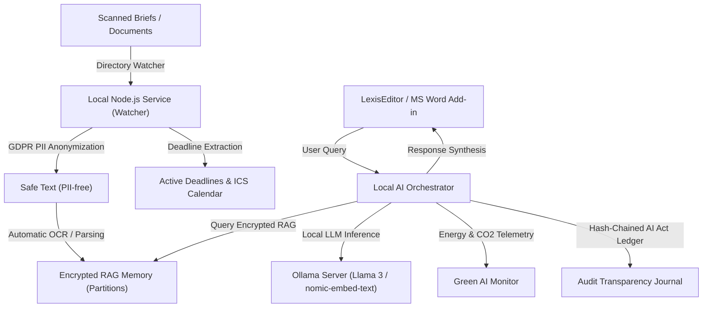

# LexisLocal ⚖️🤖
> **Lokální AI ekosystém pro advokacii / Local-First AI Legal Ecosystem**

---

### 🗺️ Jazyk / Language
Select your preferred language:
*   [🇨🇿 Česká verze (Czech Version)](#-česká-verze)
*   [🇬🇧 English Version](#-english-version)

---

# 🇨🇿 Česká verze

> **Lokální AI ekosystém zaměřený na stoprocentní soukromí a datovou suverenitu moderních advokátních kanceláří.**

LexisLocal je pokročilý, podnikový víceagentní (multi-agent) AI ekosystém navržený tak, aby běžel 100% offline a lokálně na vnitřní infrastruktuře advokátní kanceláře. Zaručuje absolutní datovou suverenitu (citlivá klientská data, obchodní tajemství ani spisy nikdy neopustí vaši lokální síť) a zároveň poskytuje advokátům špičkovou automatizaci psaní, sémantickou analýzu dokumentů, hlídání procesních lhůt, sémantické vyhledávání v archivech (RAG) a plnou shodu s evropskou legislativou (EU AI Act & GDPR Článek 20).

---

## 🏗️ Architektonický přehled



---

## 🤖 Specializovaný roj AI agentů (Swarm)

LexisLocal nespoléhá na jednoho obecného chatbota. Namísto toho nasazuje specializovaný tým botů koordinovaný **Hlavním orchestrátorem (Chief Orchestrator)**:

1.  **📚 Robot "Rešeršník"**: Vyhledává precedenty, analyzuje klientské spisy, navrhuje právní argumentaci a cituje judikaturu z lokální šifrované paměti.
2.  **✍️ Robot "Stylista"**: Analyzuje vaše minulé podání a upravuje vygenerovaný text tak, aby dokonale odpovídal vašemu osobnímu spisovému stylu (*Style Cloning*).
3.  **⚖️ Robot "Kontrolor" (Oponent)**: Podrobuje vaše texty zátěžovému testu, hledá logické chyby, rizika, slabá místa v argumentaci a kontroluje shodu s judikáty.
4.  **⏰ Robot "Sekretářka"**: Organizuje spisovou agendu, extrahuje ze spisů úkoly a schůzky a generuje kalendářové doložky (`.ics`) kompatibilní s Outlookem/Google Kalendářem.
5.  **📝 Robot "Spisovatel"**: Sestavuje precizní a neprůstřelné drafty smluv, žalob a odvolání na základě zadaných parametrů a klientského kontextu.

---

## ✨ Hlavní Inovativní Funkcionality

### 🔑 1. Šifrovaný Inbox & Databáze (Zero-Knowledge Storage)
*   **Absolutní šifrování v klidu (Data-at-rest):** Kompletní klientský inbox (původně `.inbox.json`) i databázové tabulky jsou plně zašifrovány algoritmem **AES-256-CBC** s lokálně generovaným dešifrovacím klíčem `.lexis.key`.
*   **Jednorázová automatická migrace:** Při startu aplikace systém detekuje nešifrovaná data na disku, bezpečně je převede do šifrované databáze `lexis.db` a původní plaintextové soubory trvale skartuje.
*   **Izolované RAG partitionování:** Dokumenty různých klientů jsou ukládány v samostatných šifrovaných oddílech `.rag_<hash>.json`, což znemožňuje jakékoliv křížové prosakování informací mezi spisy.

### ⛓️ 2. AI Act Transparency Ledger (Kryptografický audit)
*   **Blockchain-like integrita (Hash-Chaining):** Každé vygenerované stanovisko a dotaz na AI jsou zaznamenány v deníku transparentnosti, kde každý záznam obsahuje SHA-256 otisk předchozího logu (`prevHash`) a svůj vlastní otisk (`hash`). Zpětná změna historie je matematicky vyloučena.
*   **Měnitelná pole lidského dohledu (Human-in-the-loop):** Advokáti mohou přímo v UI schvalovat AI výstupy (`humanApproved`). Tyto změny stavu schválení jsou vyjmuty z hashe samotného stanoviska, takže integrita řetězce zůstává zachována i po lidském přezkumu.
*   **Verifikační endpoint:** Cesta `/api/audit/transparency/verify` (dostupná jako tlačítko v UI) provede kompletní kontrolu integrity celého řetězce a okamžitě odhalí jakékoliv pokusy o manipulaci s daty.

### 🌿 3. Zelené AI (Green Computing Monitor)
*   **Porovnání uhlíkové stopy:** Systém v reálném čase měří čas lokální LLM inference na vašem hardwaru a převádí jej na spotřebu energie (Wh) a emise CO₂ na základě průměrného energetického mixu EU.
*   **Odhad úspory:** Výsledné hodnoty jsou porovnávány s cloudovým voláním (např. GPT-4), což poskytuje hmatatelné podklady pro ekologický dopad (Green Deal / ESG).
*   **Hardware telemetrie:** Integrace s OS pro načítání reálných specifikací (CPU jádra, systémová zátěž, RAM využití, odhad volné/celkové VRAM grafické karty).

### 🛡️ 4. GDPR Sovereign Shield (Anonymizátor)
*   **Detekce PII:** Před odesláním textu do lokálního RAG indexu nebo LLM probíhá automatická filtrace a maskování citlivých osobních údajů (česká rodná čísla, telefonní čísla, e-mailové adresy, jména, tituly).
*   **GDPR Přenositelnost (Článek 20):** Endpoint `/api/system/export` umožňuje advokátovi jedním kliknutím stáhnout kompletní strojově čitelný dešifrovaný JSON se všemi klientskými daty, čímž splňuje požadavek na zamezení závislosti na poskytovateli (No Vendor Lock-in).

### 📁 5. Sovereign Long-Term Archival (Dublin Core XML)
*   **Standard ISO 15836:** Možnost vygenerovat standardizovaný metadatový deskriptor v XML (Dublin Core) pro archivaci právních spisů a přípravu na formát PDF/A.

---

## 💻 Doporučené hardwarové specifikace

| Parametr | Standardní pracovní stanice | Výkonný server / Mac Studio |
| :--- | :--- | :--- |
| **Procesor (CPU)** | Intel Core i7 / AMD Ryzen 7 | Apple M2/M3/M4 Ultra nebo AMD Threadripper |
| **Operační paměť (RAM)** | 32 GB DDR5 | 64 GB – 128 GB Unified Memory (Apple) |
| **Grafická karta (GPU)** | NVIDIA RTX 4070 (12GB VRAM) | NVIDIA RTX 4090 (24GB VRAM) nebo Apple GPU |
| **Pevný disk** | 1 TB NVMe SSD (Gen 4) | 4 TB Enterprise NVMe SSD |
| **Podporované LLM modely** | `llama3:8b`, `mistral:7b` | `llama3:70b`, `command-r-plus` |

---

## 🚀 Jak začít a spustit aplikaci

### 1. Nativní spuštění v liště (Tray App – Doporučeno pro uživatele)
Aplikaci lze spustit a zabalit jako klasický desktopový program pomocí přiloženého Electron.js bootstrapu:
```bash
# Instalace závislostí
npm install

# Spuštění v developerském režimu
npm run electron:dev

# Sestavení macOS instalátoru (.dmg)
npm run dist:mac

# Sestavení Windows instalátoru (.exe)
npm run dist:win
```

### 2. Spuštění na pozadí v terminálu (Pro vývojáře)
1.  Ujistěte se, že vám na pozadí běží lokální **Ollama**:
    ```bash
    ollama run llama3
    ollama run nomic-embed-text
    ```
2.  Nastartujte Express API server:
    ```bash
    npm run dev
    ```
3.  Otevřete v prohlížeči adresu `http://localhost:3000`.

#### 🔐 API token (povinný)
Všechny `/api/*` endpointy vyžadují token (statické soubory dashboardu ne). Při prvním startu se
token **automaticky vygeneruje**, vypíše do konzole a uloží mimo synchronizovaná data
(`~/Library/Application Support/LexisLocal/api_token` na macOS, `%APPDATA%\LexisLocal\api_token`
na Windows, `~/.config/lexislocal/api_token` na Linuxu). Token zadejte jednou v dashboardu do pole
**„API token"** (uloží se do prohlížeče), nebo ho posílejte v hlavičce `X-API-Token`
či `Authorization: Bearer <token>`. Vlastní token lze vynutit přes proměnnou prostředí:
```bash
API_TOKEN="vas-tajny-token" npm run dev
```
Server se ve výchozím stavu váže na `127.0.0.1` (jen tento počítač). Pro přístup z LAN/více zařízení
nastavte `HOST=0.0.0.0` a případně povolené originy přes `ALLOWED_ORIGINS` (čárkou oddělené).

### 🧪 Spuštění testovací sady
Projekt obsahuje komplexní sadu 116 unit testů, které pokrývají šifrování, migraci dat, hash-chaining, anonymizaci i sémantické vyhledávání:
```bash
npm test
```

---

# 🇬🇧 English Version

> **Local-first AI legal ecosystem focused on absolute privacy, data sovereignty, and compliance for modern law firms.**

LexisLocal is an advanced, enterprise-grade multi-agent AI ecosystem designed to run 100% offline and locally on a law firm's internal infrastructure. It guarantees full data sovereignty (no sensitive client data, trade secrets, or case briefs ever leave the local network) while providing lawyers with state-of-the-art legal drafting, document analysis, automated workflow scheduling, RAG-based search, and full compliance with European regulations (EU AI Act & GDPR Article 20).

---

## 🏗️ Architectural Overview



---

## 🤖 Special Agent Swarm

LexisLocal does not rely on a single generic chatbot. Instead, it deploys a team of highly-focused, specialized agents coordinated by the **Chief Orchestrator**:

1.  **📚 Robot "Rešeršník" (The Researcher)**: Searches and cross-references case files and court decisions from local encrypted storage.
2.  **✍️ Robot "Stylista" (The Stylist)**: Analyzes past briefs and refines generated text to match the attorney's specific writing style (*"Style Cloning"*).
3.  **⚖️ Robot "Kontrolor" (The Adversary)**: Acts as an opponent, stress-testing legal arguments and pointing out logical gaps, risks, or compliance issues.
4.  **⏰ Robot "Sekretářka" (The Scheduler)**: Syncs deadlines with MS Outlook/Google Calendar and manages internal files.
5.  **📝 Robot "Spisovatel" (The Writer)**: Drafts precise, structured agreements, briefs, and legal forms from client context.

---

## ✨ Key Innovative Features

### 🔑 1. Encrypted Inbox & DB (Zero-Knowledge Storage)
*   **Absolute Data-at-rest Encryption:** The entire inbox metadata and database tables are encrypted using the **AES-256-CBC** algorithm with a locally generated key `.lexis.key`.
*   **Automatic Data Migration:** Upon launch, the system automatically migrates legacy unencrypted inbox data to the secure database and unlinks the plaintext files.
*   **Isolated RAG Partitions:** Case documents are divided into client-scoped partitions `.rag_<hash>.json`, strictly preventing any cross-contamination of case details.

### ⛓️ 2. AI Act Transparency Ledger (Cryptographic Audit Trail)
*   **Blockchain-like Integrity (Hash-Chaining):** Every AI request is recorded with a SHA-256 link to the preceding record (`prevHash`), forming a tamper-proof chain.
*   **Human-in-the-loop Review:** Attorney approvals (`humanApproved`) are excluded from the hash calculations, allowing mutable review status updates without breaking the historical cryptographic chain.
*   **Verification Utility:** The `/api/audit/transparency/verify` endpoint verifies the ledger's integrity and flags any data-tampering attempts.

### 🌿 3. Green AI & Telemetry Monitoring
*   **Carbon Footprint Tracker:** Computes execution time and translates local LLM inference into energy metrics (Wh) and CO₂ emissions.
*   **Saved vs. Cloud Comparison:** Contrasts local edge-AI execution against cloud alternatives to generate empirical Green Deal / ESG compliance reports.
*   **System Telemetry:** Live collection of system metrics (CPU cores, RAM load, VRAM, and uptime).

### 🛡️ 4. GDPR Sovereign Shield (PII Redactor)
*   **PII Redactor:** Automatically filters and redacts birth numbers, email addresses, phone numbers, addresses, and names before text enters RAG vector databases.
*   **GDPR Article 20 Portability:** A clean `/api/system/export` endpoint outputs decrypted system data to avoid vendor lock-in.

---

## 💻 Recommended Hardware Specs

| Specification | Standard Workstation | Premium Server / Mac Studio |
| :--- | :--- | :--- |
| **CPU** | Intel Core i7 / AMD Ryzen 7 | Apple M2/M3/M4 Ultra or AMD Threadripper |
| **RAM** | 32 GB DDR5 | 64 GB – 128 GB Unified Memory |
| **GPU** | NVIDIA RTX 4070 (12GB VRAM) | NVIDIA RTX 4090 (24GB VRAM) or Apple GPU |
| **Storage** | 1 TB NVMe SSD (Gen 4) | 4 TB Enterprise NVMe SSD |
| **LLM Supported** | `llama3:8b`, `mistral:7b` | `llama3:70b`, `command-r-plus` |

---

## 🚀 Getting Started

### 1. Native Tray App Execution (Recommended for End-Users)
Launch and package the application natively using Electron.js:
```bash
# Install dependencies
npm install

# Run in developer mode
npm run electron:dev

# Build macOS installer (.dmg)
npm run dist:mac

# Build Windows installer (.exe)
npm run dist:win
```

### 2. Headless API Server Execution (For Developers)
1.  Ensure **Ollama** is running locally:
    ```bash
    ollama run llama3
    ollama run nomic-embed-text
    ```
2.  Start the Express API:
    ```bash
    npm run dev
    ```
3.  Open `http://localhost:3000` in your web browser.

#### 🔐 API token (required)
All `/api/*` endpoints require a token (dashboard static files do not). On first start a token is
**generated automatically**, printed to the console, and stored outside synced data
(`~/Library/Application Support/LexisLocal/api_token` on macOS, `%APPDATA%\LexisLocal\api_token` on
Windows, `~/.config/lexislocal/api_token` on Linux). Enter it once in the dashboard **"API token"**
field (persisted in the browser), or send it via the `X-API-Token` header or
`Authorization: Bearer <token>`. To force your own token use an environment variable:
```bash
API_TOKEN="your-secret-token" npm run dev
```
The server binds to `127.0.0.1` by default (this machine only). For LAN/multi-device access set
`HOST=0.0.0.0` and optionally allowed origins via `ALLOWED_ORIGINS` (comma-separated).

### 🧪 Running tests
Run the full test suite (116 passing tests) validating encryption, RAG partitioning, anonymizer patterns, and ledger integrity:
```bash
npm test
```
