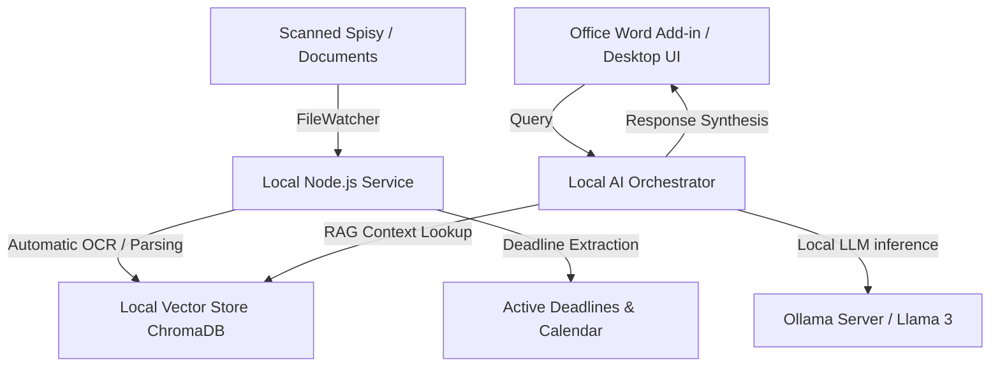

# LexisLocal ⚖️🤖
> **Privacy-Focused, Local-First AI Legal Ecosystem for Modern Law Firms**

LexisLocal is an advanced, enterprise-grade multi-agent AI ecosystem designed to run 100% offline and locally on a law firm's internal infrastructure. It ensures full data sovereignty (no sensitive client data or trade secrets ever leave the local network) while providing lawyers with state-of-the-art legal drafting, document analysis, automated workflow scheduling, and RAG-based research.

---

## 🏗️ Architectural Overview



---

## 🤖 Special Agent Swarm (Specializovaní Boti)

LexisLocal does not rely on a single generic chatbot. Instead, it deploys a team of highly-focused, specialized agents:

1. **Robot "Rešeršník" (The Researcher)**: Searches and cross-references laws, local documents, and supreme court rulings.
2. **Robot "Stylista" (The Stylist)**: Analyzes past briefs and refines generated text to match the attorney's specific writing style (*"Style Cloning"*).
3. **Robot "Kontrolor" (The Adversary)**: Acts as an opponent, stress-testing legal arguments and pointing out logical gaps or contradictions.
4. **Robot "Sekretářka" (The Scheduler)**: Syncs deadlines with MS Outlook and manages internal files.

---

## 💻 Recommended Hardware Specs

Because all AI computations run completely locally for 100% data privacy:

| Specification | Standard Workstation | Premium Server / Mac Studio |
| :--- | :--- | :--- |
| **CPU** | Intel Core i7 / AMD Ryzen 7 | Apple M2/M3 Ultra or AMD Threadripper |
| **RAM** | 32 GB DDR5 | 64 GB - 128 GB Unified Memory |
| **GPU** | NVIDIA RTX 4070 (12GB VRAM) | NVIDIA RTX 4090 (24GB VRAM) or Apple GPU |
| **Storage** | 1 TB NVMe SSD (Gen 4) | 4 TB Enterprise NVMe SSD |
| **LLM Supported** | `llama3:8b`, `mistral:7b` | `llama3:70b`, `command-r-plus` |

---

## 📂 Repository Structure

- `backend/`: Core Node.js orchestrator server connecting to Ollama and ChromaDB.
- `frontend/`: Dashboard for managing local files, RAG indexes, and active agents.
- `integrations/`: Manifest and code for the Microsoft Word / Office.js Add-in.

---

## 🚀 Getting Started

1. Ensure **Ollama** is running locally:
   ```bash
   ollama run llama3
   ```
2. Install dependencies and start the backend:
   ```bash
   npm install
   npm run dev
   ```
