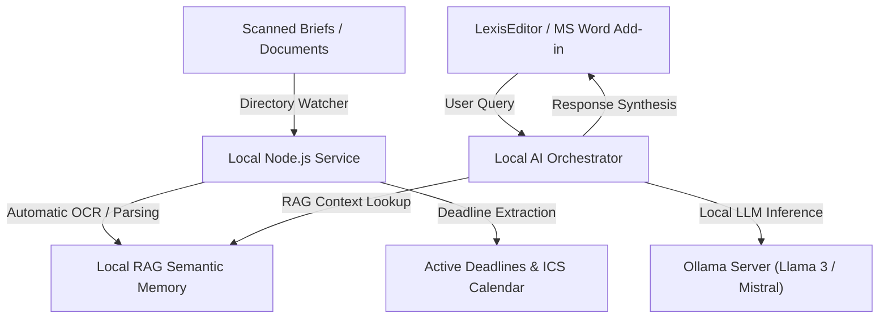

# LexisLocal ⚖️🤖
> **Lokální AI ekosystém pro advokacii / Local-First AI Legal Ecosystem**

---

### 🗺️ Jazyk / Language
Select your preferred language:
*   [🇨🇿 Česká verze (Czech Version)](#-česká-verze)
*   [🇬🇧 English Version](#-english-version)

---

# 🇨🇿 Česká verze

> **Lokální AI ekosystém zaměřený na stoprocentní soukromí a datovou suverenitu moderních advokátních kanceláří.**

LexisLocal je pokročilý, podnikový víceagentní (multi-agent) AI ekosystém navržený tak, aby běžel 100% offline a lokálně na vnitřní infrastruktuře advokátní kanceláře. Zaručuje absolutní datovou suverenitu (citlivá klientská data, obchodní tajemství ani spisy nikdy neopustí vaši lokální síť) a zároveň poskytuje advokátům špičkovou automatizaci psaní, sémantickou analýzu dokumentů, hlídání procesních lhůt a sémantické vyhledávání v archivech (RAG).

## 🏗️ Architektonický přehled

```mermaid
graph TD
    A["Naskenované spisy / Dokumenty"] -->|Sledování složek| B["Lokální Node.js služba"]
    B -->|Automatické OCR / Parsování| C["Lokální sémantická paměť (RAG)"]
    B -->|Extrakce procesních lhůt| D["Aktivní lhůty & ICS Kalendář"]
    E["LexisEditor / MS Word Add-in"] -->|Uživatelský dotaz| F["Lokální AI orchestrátor"]
    F -->|Sémantické vyhledávání (RAG)| C
    F -->|Lokální LLM inference| G["Ollama Server (Llama 3 / Mistral)"]
    F -->|Syntéza bezpečné odpovědi| E
```

## 🤖 Specializovaný roj AI agentů (Swarm)

LexisLocal nespoléhá na jednoho obecného chatbota. Namísto toho nasazuje specializovaný tým botů, z nichž každý dokonale ovládá svou roli:

1.  **📚 Robot "Rešeršník"**: Vyhledává precedenty, analyzuje klientské spisy, navrhuje právní argumentaci a cituje judikaturu.
2.  **✍️ Robot "Stylista"**: Analyzuje vaše minulé podání a upravuje vygenerovaný text tak, aby dokonale odpovídal vašemu osobnímu spisovému stylu (*Style Cloning*).
3.  **⚖️ Robot "Kontrolor"**: Funguje jako oponentní právní zástupce. Podrobuje vaše texty zátěžovému testu, hledá logické chyby, rizika a slabá místa v argumentaci.
4.  **⏰ Robot "Sekretářka"**: Organizuje spisovou agendu, extrahuje ze spisů úkoly a schůzky a generuje kalendářové doložky (`.ics`) kompatibilní s Outlookem.
5.  **📝 Robot "Spisovatel"**: Sestavuje precizní a neprůstřelné drafty smluv, žalob a odvolání na základě zadaných parametrů a klientského kontextu.

## ✨ Hlavní Funkcionality (Features)

*   **🔒 Šifrovaná lokální databáze (AES-256)**: Kompletní šifrování spisů, logů a citlivých klientských dat v zero-dependency relačním souborovém subsystému s atomickými zápisy.
*   **🔍 Detektor střetu zájmů (Conflict Check)**: Sémantická analýza archivu klientských dokumentů pomocí RAG indexů. Automaticky detekuje riziko střetu zájmů s protistranou při onboardingu.
*   **⚖️ Hlídač judikatury (Template Compliance)**: Porovnávání textů doložek a smluv s precedentními judikáty Nejvyššího soudu (NS) a e-Sbírky. Navrhuje legislativně bezchybné opravy doložek.
*   **🕒 Time-tracking & AI Timesheety**: Integrace na pozadí s LexisEditorerem, automatická detekce odpracovaného času a generování profesionálních, česky stylizovaných denních výkazů lokální AI.
*   **📊 Manažerská ziskovost (Profitability & Capacity)**: Nastavení budgetů pro spisy v %, hlídání přefakturace a automatické monitorování zátěže koncipientů na základě aktivních lhůt.

## 💻 Doporučené hardwarové specifikace

| Parametr | Standardní pracovní stanice | Výkonný server / Mac Studio |
| :--- | :--- | :--- |
| **Procesor (CPU)** | Intel Core i7 / AMD Ryzen 7 | Apple M2/M3/M4 Ultra nebo AMD Threadripper |
| **Operační paměť (RAM)** | 32 GB DDR5 | 64 GB – 128 GB Unified Memory (Apple) |
| **Grafická karta (GPU)** | NVIDIA RTX 4070 (12GB VRAM) | NVIDIA RTX 4090 (24GB VRAM) nebo Apple GPU |
| **Pevný disk** | 1 TB NVMe SSD (Gen 4) | 4 TB Enterprise NVMe SSD |
| **Podporované LLM modely** | `llama3:8b`, `mistral:7b` | `llama3:70b`, `command-r-plus` |

## 🚀 Jak začít a spustit aplikaci

### 1. Nativní spuštění v liště (Tray App – Doporučeno pro uživatele)
Aplikaci stačí spustit jako běžný program do horní lišty (Dropbox styl):
```bash
# Instalace závislostí
npm install

# Spuštění v developerském režimu
npm run electron:dev

# Sestavení macOS instalátoru (.dmg)
npm run dist:mac

# Sestavení Windows instalátoru (.exe)
npm run dist:win
```

### 2. Spuštění na pozadí v terminálu (Pro vývojáře)
Pokud chcete spouštět pouze samotné API bez grafického rozhraní:
1.  Uistěte se, že vám na pozadí běží lokální **Ollama**:
    ```bash
    ollama run llama3
    ```
2.  Nastartujte Express API server:
    ```bash
    npm run dev
    ```

---

# 🇬🇧 English Version

> **Privacy-Focused, Local-First AI Legal Ecosystem for Modern Law Firms.**

LexisLocal is an advanced, enterprise-grade multi-agent AI ecosystem designed to run 100% offline and locally on a law firm's internal infrastructure. It ensures full data sovereignty (no sensitive client data or trade secrets ever leave the local network) while providing lawyers with state-of-the-art legal drafting, document analysis, automated workflow scheduling, and RAG-based research.

## 🏗️ Architectural Overview



## 🤖 Special Agent Swarm

LexisLocal does not rely on a single generic chatbot. Instead, it deploys a team of highly-focused, specialized agents:

1.  **📚 Robot "Rešeršník" (The Researcher)**: Searches and cross-references laws, local documents, and supreme court rulings.
2.  **✍️ Robot "Stylista" (The Stylist)**: Analyzes past briefs and refines generated text to match the attorney's specific writing style (*"Style Cloning"*).
3.  **⚖️ Robot "Kontrolor" (The Adversary)**: Acts as an opponent, stress-testing legal arguments and pointing out logical gaps or contradictions.
4.  **⏰ Robot "Sekretářka" (The Scheduler)**: Syncs deadlines with MS Outlook and manages internal files.
5.  **📝 Robot "Spisovatel" (The Writer)**: Drafts precise, structured agreements, briefs, and legal forms from client context.

## ✨ Key Features

*   **🔒 AES-256 Encrypted Local Database**: Full offline encryption of clients, logs, and briefs with zero-dependency atomic transaction files.
*   **🔍 Conflict of Interest Detector**: Deep semantic matching of onboarding clients and counterparties against historical archives via RAG index.
*   **⚖️ Supreme Court Compliance Watcher**: Automatic screening of contracts against latest case laws with inline suggested remedies.
*   **🕒 Activity Time-tracking & AI Timesheets**: Heartbeat listeners connected to LexisEditor with automatic professional daily billings synthesized by local LLM.
*   **📊 Managerial Profitability & Capacity Allocation**: Real-time margin monitoring, budgets trackers, and team workload indices.

## 💻 Recommended Hardware Specs

| Specification | Standard Workstation | Premium Server / Mac Studio |
| :--- | :--- | :--- |
| **CPU** | Intel Core i7 / AMD Ryzen 7 | Apple M2/M3/M4 Ultra or AMD Threadripper |
| **RAM** | 32 GB DDR5 | 64 GB – 128 GB Unified Memory |
| **GPU** | NVIDIA RTX 4070 (12GB VRAM) | NVIDIA RTX 4090 (24GB VRAM) or Apple GPU |
| **Storage** | 1 TB NVMe SSD (Gen 4) | 4 TB Enterprise NVMe SSD |
| **LLM Supported** | `llama3:8b`, `mistral:7b` | `llama3:70b`, `command-r-plus` |

## 🚀 Getting Started

### 1. Native Tray App Execution (Recommended for End-Users)
Run the application natively as a system menu bar tray app:
```bash
# Install dependencies
npm install

# Run in developer mode
npm run electron:dev

# Build macOS installer (.dmg)
npm run dist:mac

# Build Windows installer (.exe)
npm run dist:win
```

### 2. Headless API Server Execution (For Developers)
To run the Express backend standalone:
1.  Ensure **Ollama** is running locally:
    ```bash
    ollama run llama3
    ```
2.  Start the Express API:
    ```bash
    npm run dev
    ```
